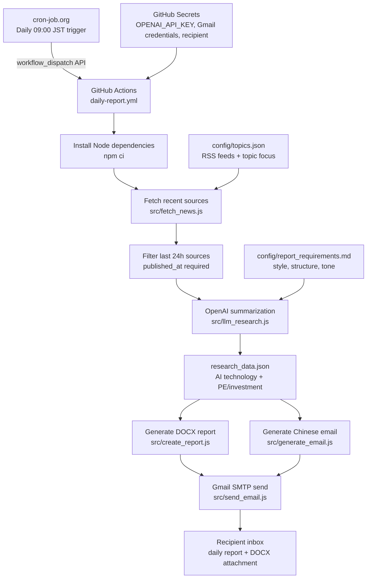

# AI Daily Report Automation

[中文说明](README.zh-CN.md)

A Codex-ready workflow for generating a daily AI intelligence report:

1. Search current AI news and investment signals.
2. Save structured research data as JSON.
3. Generate a Word report (`.docx`).
4. Generate a structured Simplified Chinese email brief.
5. Use Gmail tooling in Codex to send or draft the email.

The project is designed as a public template. It does not include private email addresses, generated reports, or live credentials.

## Architecture



The production timer is external: cron-job.org calls GitHub Actions through `workflow_dispatch`. GitHub's built-in `schedule` trigger is disabled to avoid duplicate reports.

## What It Produces

- `outputs/AI_Daily_Report_YYYY-MM-DD.docx`
- `email_body.txt`
- A Gmail-ready Chinese email body with:
  - A short greeting to `yidan` or your configured recipient name
  - A concise, lightly humorous executive summary
- Core takeaways
- AI technology angle
- PE / investment angle
- Integrated judgment
- Source publication time for every item
- Source URLs

## Quick Start

Install dependencies:

```bash
npm install
```

Run the example:

```bash
npm run check
```

Run with your own `research_data.json`:

```bash
npm run generate
```

## Input Format

Create `research_data.json` in the project root:

```json
{
  "date": "YYYY-MM-DD",
  "lookback_hours": 24,
  "generated_at": "ISO-8601 timestamp",
  "ai_technology": [
    {
      "topic": "Topic title",
      "summary": "Brief factual summary.",
      "impact": "Why it matters.",
      "source_published_at": "ISO-8601 timestamp",
      "source": "https://example.com"
    }
  ],
  "pe_investment": [
    {
      "topic": "Topic title",
      "amount": "$100M",
      "summary": "Brief factual summary.",
      "impact": "Why it matters.",
      "source_published_at": "ISO-8601 timestamp",
      "source": "https://example.com"
    }
  ]
}
```

See [examples/research_data.example.json](examples/research_data.example.json).

## Codex Automation

Use [docs/codex_automation_prompt.md](docs/codex_automation_prompt.md) as the daily automation prompt.

Recommended schedule:

```text
Every day at 09:00 in your local timezone
```

The automation should:

- Gather fresh web search results each day.
- Use only sources published or updated within the previous 24 hours.
- Include source publication time for every selected item.
- Avoid stale test data.
- Generate the DOCX report.
- Generate the Chinese email body.
- Send the email via Gmail if available.
- Fall back to creating a Gmail draft if direct send is unavailable.

## GitHub Actions Automation

For reliable unattended delivery, use the included GitHub Actions workflow:

```text
.github/workflows/daily-report.yml
```

Scheduling is handled by cron-job.org, which triggers this workflow through GitHub's `workflow_dispatch` API. The workflow can also be triggered manually from the GitHub Actions tab.

Required GitHub Secrets:

```text
OPENAI_API_KEY
GMAIL_USER
GMAIL_APP_PASSWORD
REPORT_RECIPIENT
```

Optional GitHub Secrets:

```text
OPENAI_MODEL
REPORT_RECIPIENT_NAME
```

To change the report style, edit:

```text
config/report_requirements.md
```

To change source topics and RSS feeds, edit:

```text
config/topics.json
```

Run the same pipeline locally:

```bash
npm run daily
```

## Gmail Notes

This repository does not send Gmail directly from Node.js. In the Codex workflow, Gmail is handled by the Gmail connector/plugin.

For public reuse, configure your recipient through the automation prompt or an environment variable such as:

```bash
REPORT_RECIPIENT=your-email@example.com
```

## DOCX Notes

The report uses the `docx` package. Page numbers use:

```js
new SimpleField('PAGE')
```

Do not use `PageNumber`, which can fail depending on the `docx` package version.

## License

MIT
