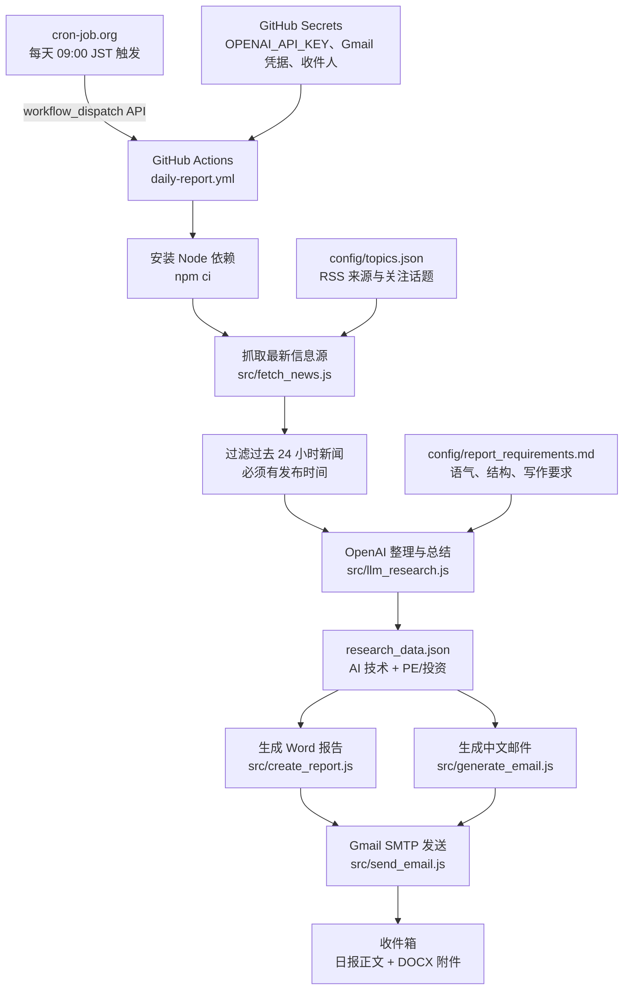

# AI 每日报告自动化

[English README](README.md)

这是一个面向 Codex 的 AI 每日报告自动化模板，用于每天生成 AI 行业情报简报、Word 报告附件，以及结构化中文邮件正文。

项目适合这些场景：

- 每天追踪硅谷 AI 热点
- 每天整理华尔街 / PE 对 AI 的投资动态
- 自动生成中文高管简报
- 自动生成 `.docx` 报告附件
- 通过 Codex 的 Gmail 工具发送或创建邮件草稿

这个仓库是公开模板，不包含私人邮箱、真实凭据、已生成报告或 Gmail token。

## 架构图



正式定时器由 cron-job.org 负责，它通过 `workflow_dispatch` 触发 GitHub Actions。GitHub 自带 `schedule` 已关闭，避免一天重复发送两封。

## 生成内容

运行后会生成：

- `outputs/AI_Daily_Report_YYYY-MM-DD.docx`
- `email_body.txt`

邮件正文为简体中文，默认结构包括：

- 对收件人的简短称呼
- 一句简练、轻松的小总结
- 今日核心摘要
- AI 技术角度
- PE / 投资角度
- 综合判断
- 每条信息源的发布时间
- 来源链接

## 快速开始

安装依赖：

```bash
npm install
```

运行示例数据：

```bash
npm run check
```

使用自己的 `research_data.json` 生成报告：

```bash
npm run generate
```

## 输入数据格式

在项目根目录创建 `research_data.json`：

```json
{
  "date": "YYYY-MM-DD",
  "lookback_hours": 24,
  "generated_at": "ISO-8601 timestamp",
  "ai_technology": [
    {
      "topic": "主题标题",
      "summary": "简短事实摘要。",
      "impact": "影响判断。",
      "source_published_at": "ISO-8601 timestamp",
      "source": "https://example.com"
    }
  ],
  "pe_investment": [
    {
      "topic": "主题标题",
      "amount": "$100M",
      "summary": "简短事实摘要。",
      "impact": "影响判断。",
      "source_published_at": "ISO-8601 timestamp",
      "source": "https://example.com"
    }
  ]
}
```

示例文件见：[examples/research_data.example.json](examples/research_data.example.json)

## Codex 自动化

每日自动化提示词在这里：

[docs/codex_automation_prompt.md](docs/codex_automation_prompt.md)

推荐运行时间：

```text
每天早上 09:00，使用你的本地时区
```

自动化任务应该执行：

- 每天重新进行 Web 搜索
- 只使用过去 24 小时内发布或更新的信息源
- 在每条新闻里标注来源时间
- 避免复用旧测试数据
- 生成 Word 报告
- 生成中文结构化邮件正文
- 如果 Gmail 工具可用，直接发送邮件
- 如果不能直接发送，则创建 Gmail 草稿

## GitHub Actions 自动发送

为了实现真正无人值守的每日发送，仓库已经包含 GitHub Actions workflow：

```text
.github/workflows/daily-report.yml
```

定时由 cron-job.org 负责，它会通过 GitHub 的 `workflow_dispatch` API 触发这个 workflow。你也可以在 GitHub 的 Actions 页面手动触发。

你需要在 GitHub 仓库里配置这些 Secrets：

```text
OPENAI_API_KEY
GMAIL_USER
GMAIL_APP_PASSWORD
REPORT_RECIPIENT
```

可选 Secrets：

```text
OPENAI_MODEL
REPORT_RECIPIENT_NAME
```

其中：

- `OPENAI_API_KEY`：用于整理新闻并生成结构化日报
- `GMAIL_USER`：发件 Gmail 地址
- `GMAIL_APP_PASSWORD`：Gmail 应用专用密码，不是 Gmail 登录密码
- `REPORT_RECIPIENT`：收件邮箱
- `OPENAI_MODEL`：可选，默认使用 `gpt-4.1-mini`
- `REPORT_RECIPIENT_NAME`：可选，默认称呼 `yidan`

## 如何随时改需求

修改这个文件即可调整日报风格和要求：

```text
config/report_requirements.md
```

例如你可以改：

- 称呼方式
- 是否保留幽默开场
- 更偏投资视角还是产品视角
- 每个板块的字段
- 语气和长度

修改这个文件可以调整关注话题和 RSS 来源：

```text
config/topics.json
```

本地运行同一套流程：

```bash
npm run daily
```

## Gmail 说明

GitHub Actions 版本会通过 Gmail SMTP 发送邮件。

Codex 工作流里，Gmail 发送也可以由 Gmail connector / plugin 完成。你可以在自动化提示词里配置收件人，也可以用环境变量保存配置，例如：

```bash
REPORT_RECIPIENT=your-email@example.com
```

公开仓库中不要提交：

- 私人邮箱
- API key
- OAuth token
- 已生成的真实报告
- 邮件正文成品

## DOCX 说明

报告使用 `docx` 包生成。

页码使用：

```js
new SimpleField('PAGE')
```

不要使用 `PageNumber`，因为它在某些 `docx` 版本中可能不可用或行为不稳定。

## 目录结构

```text
.
├── docs/
│   └── codex_automation_prompt.md
├── examples/
│   └── research_data.example.json
├── src/
│   ├── create_report.js
│   ├── generate_email.js
│   └── run.js
├── .env.example
├── package.json
├── README.md
└── README.zh-CN.md
```

## 常见工作流

1. Codex 每天搜索最新 AI 信息。
2. Codex 整理为 `research_data.json`。
3. 脚本生成 Word 报告。
4. 脚本生成中文邮件正文。
5. Codex 调用 Gmail 工具发送邮件或保存草稿。

## 许可证

MIT
